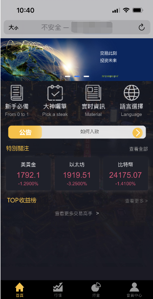
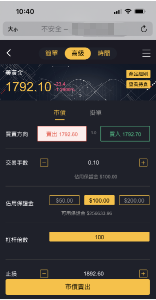
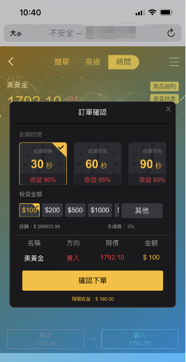
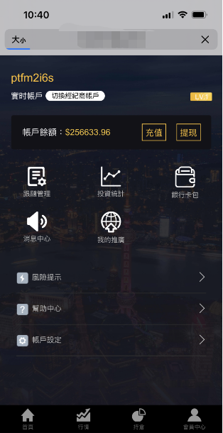
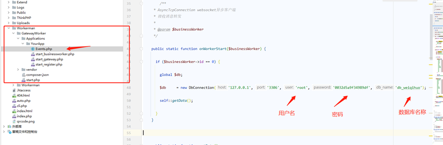
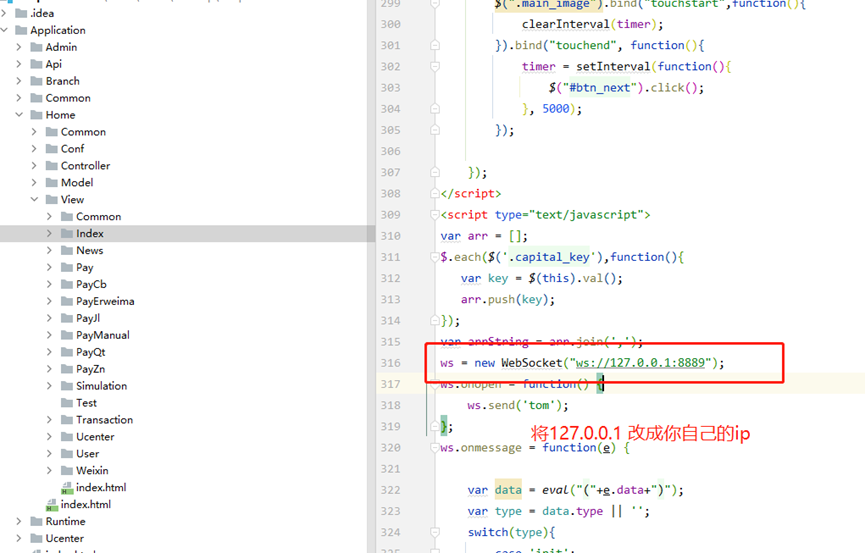
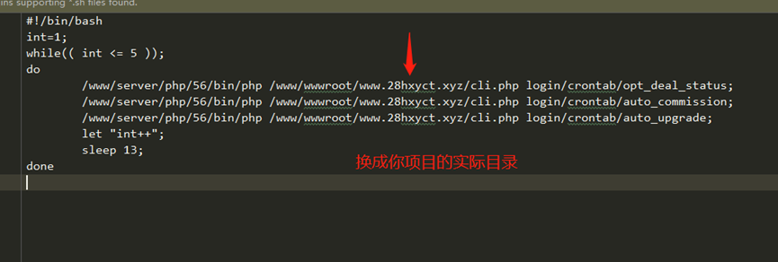
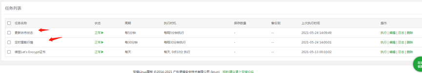
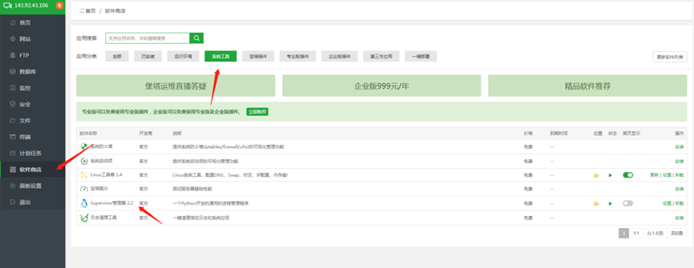
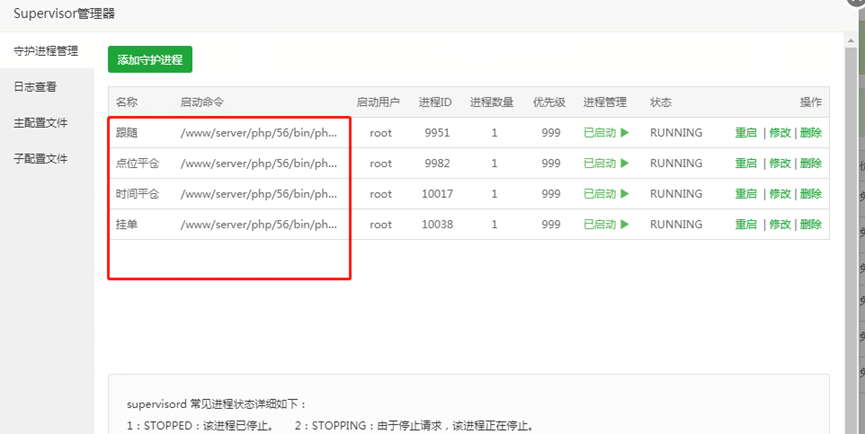

# 期货、外汇、数字货币、行情交易php源码
# 开源代码仅供参考学习，请勿用于非法用途！！！

**环境要求：**

> Php5.6  mysql5.7 nginx redis memcahed
>
> 项目数据库配置信息在 Application/Common/config.php中
>
> 系统设有3个后台，分别为：总后台 ->> 运营中心 -> 销售商
> 
> 登录账户： 后台地址：http://域名/login
> 
> 总后台账户：admin/123456 
>
> 运营中心：yunyingzhongxin/123456 
> 
> 代理商：xiaoshoushang/123456 
> 
> 手机端普通用户账户：123456@qq.com/123456

**注意事项：**

> 1、修改根目录中的index.php，将域名更换为您实际的域名，否则系统登陆会失败  define('ADMIN_URL','test.com');
>
> 2、总后台登陆，使用了谷歌验证器，您需要下载谷歌【Authenticator】 App，将秘钥设置成功后，即可获得对应的登陆验证码。
> 默认谷歌验证器秘钥为：YD2HX4K44VFVH7PO

## 以下共3个地方需要启动相关计划脚本

## 1：数据源对接：
> **数据源使用地址（备注）：http://39.107.99.235:1008/market/market.php**
>
> 行情接收启动命令： 启动前请确定ip已授权，行情对接完成
>
> 启动前需要修改：Events.php 将数据库信息改为自己的
> 
>
> 启动命令： /www/server/php/56/bin/php
> /www/wwwroot/www.28hxyct.xyz/Workerman/GatewayWorker/start.php restart
> –d
>
> 目录：www.28hxyct.xyz 换成你的项目实际目录
>
> 命令启动完毕之后，修改对应的html、将连接的websocket地址改成你自己的服务器， 如果域名为https，前缀需要使用wss
> 并在nginx配置代理即可
>
> 例如：
> 

## 2：宝塔计划任务：

> 1：每隔5分钟定时更新休市状态 	脚本内容：
>     sh /www/wwwroot/www.28hxyct.xyz/job.sh 	www.28hxyct.xyz 换成你的项目实际目录 	job.sh在你的项目根目录下，如果需要更换新的项目需要进入修改该文件。
>     命令如下：
>
> 
>
> 2：每隔30分钟定时重载行情（这个最小30分钟，时间不要小于30分钟）
> 	脚本内容：/www/server/php/56/bin/php
> /www/wwwroot/www.28hxyct.xyz/Workerman/GatewayWorkerNew/start.php reload –d  www.28hxyct.xyz 换成你的项目实际目录
> 

## 3：宝塔Supervisor管理器

> 跟随脚本：/www/server/php/56/bin/php cli.php Home/CrontabFollow/settlement
> 点位平仓脚本：/www/server/php/56/bin/php cli.php Home/CrontabPosition/settlement
> 时间平仓脚本：/www/server/php/56/bin/php cli.php Home/CrontabTimePosition/settlement
> 挂单脚本：/www/server/php/56/bin/php cli.php Home/CrontabResting/settlement
>
> 
> 
> 
> **添加计划步骤如下：**
> 

